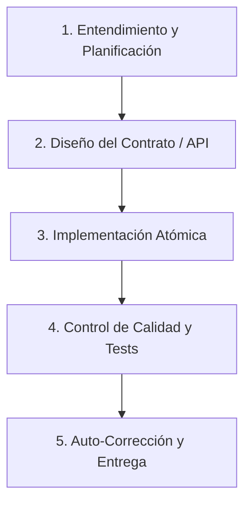

# 🤖 Guía de Colaboración de Agentes y Estándares para Desarrollo Web

Este documento establece el protocolo operativo, la división de roles y los estándares de calidad para todo el equipo de agentes de IA que trabajan en el proyecto **SplitEasy** y otros proyectos del ecosistema. 

Cualquier agente que modifique, analice o proponga cambios en este repositorio **debe cumplir estrictamente** con estas directrices.

---

## 🎯 Principio Rector (Prime Directive)
> **Maximizar la velocidad de desarrollo sin comprometer la integridad estructural ni la seguridad del sistema.**
> Todas las intervenciones de los agentes deben ser **atómicas, no destructivas y completamente explicadas**.

---

## 👥 Roles del Equipo de Agentes

Para garantizar la calidad y evitar conflictos de sobreescritura, las tareas se dividen en los siguientes roles virtuales. Identifica tu rol antes de actuar:

### 1. 📐 Arquitecto & Líder de Integración (Tech Lead)
*   **Responsabilidad:** Diseñar la estructura general, las interfaces entre componentes y la API del sistema.
*   **Mandato:** 
    *   Mantener la separación estricta de responsabilidades (UI, Lógica de Negocio, Datos).
    *   Exigir el patrón de **Agnosticismo de Dependencias** (creación de Wrappers o interfaces al importar librerías externas).
    *   Asegurar que la lógica de negocio permanezca agnóstica a la infraestructura (ej. que los servicios no dependan de HTTP ni de GORM directamente).

### 2. ⚙️ Desarrollador Backend (Go Specialist)
*   **Responsabilidad:** Desarrollar los servicios, repositorios, enrutadores y bases de datos en Go.
*   **Mandato:**
    *   Seguir al pie de la letra el `code-style-guide copy.md` (identación con tabs, nomenclatura `camelCase` para privados, `PascalCase` para públicos, primer parámetro siempre `context.Context`).
    *   Utilizar `log/slog` para registros y telemetría.
    *   Implementar el patrón **Early Return** en las funciones para evitar anidamientos excesivos.
    *   Gestionar y propagar todos los errores (nunca ignorar errores con `_`).

### 3. 🎨 Desarrollador Frontend (UX/UI Specialist)
*   **Responsabilidad:** Crear interfaces de usuario altamente estéticas, fluidas y responsivas.
*   **Mandato:**
    *   **Estética Premium:** La interfaz debe sorprender gratamente al usuario. Utilizar paletas de colores armónicas (evitar colores planos como rojo puro, azul puro; preferir paletas personalizadas HSL, modos oscuros elegantes, gradientes suaves y efectos de glassmorphic/backdrop-filters).
    *   **Sin placeholders:** No usar imágenes rotas o vacías. Usar la herramienta `generate_image` para generar activos y UI reales.
    *   **Tipografía y Animaciones:** Usar tipografías modernas (Google Fonts: Inter, Outfit, Roboto) y añadir micro-animaciones en estados hover y transiciones.
    *   **Estilo:** Utilizar Vanilla CSS a menos que el usuario pida explícitamente TailwindCSS.
    *   **SEO & Accesibilidad (a11y):** Asegurar la estructura semántica de HTML (un solo `<h1>`), targets de click adecuados, contraste de color correcto y soporte completo para navegación con teclado.

### 4. 🧪 Agente de Control de Calidad (QA & Testing)
*   **Responsabilidad:** Validar el correcto funcionamiento del software y evitar regresiones.
*   **Mandato:**
    *   Asegurar que todas las rutas críticas tengan pruebas unitarias y de integración.
    *   Validar la compilación y pruebas de todo el proyecto (`go test ./...`) antes de entregar cualquier cambio.

---

## 🛠️ Ciclo de Trabajo Obligatorio (Protocolo de 5 Pasos)

Cualquier cambio de complejidad media o alta debe pasar por las siguientes fases:

### Paso 1: Entendimiento y Planificación
*   **Acción:** Antes de modificar nada, analiza el código existente.
*   **Contexto:** Si vas a refactorizar código que no creaste, **debes documentar y explicar por qué existía y por qué debe cambiar**. No elimines dependencias sin entenderlas.
*   **Planificación:** Crea o actualiza el archivo `implementation_plan.md` si la tarea lo requiere, especificando la estrategia.

### Paso 2: Diseño de Interfaces / API First
*   **Acción:** Si vas a crear una funcionalidad que conecta Frontend y Backend, define primero el contrato de datos (JSON request/response, endpoints) antes de codificar la lógica interna.

### Paso 3: Implementación Inmutable y Limpia
*   **Acción:** Escribe código autodocumentado. Evita comentarios obvios; usa comentarios solo para lógicas altamente complejas, TODOs a futuro o FIXMEs.
*   **Inmutabilidad:** Trata los datos como inmutables por defecto para evitar efectos secundarios imprevistos entre diferentes ejecuciones de agentes.

### Paso 4: Pruebas y Compilación
*   **Acción:** Compila el proyecto y ejecuta la suite de pruebas local.
*   **Error Handling:** Verifica que ningún error sea silenciado y que todos los errores HTTP devuelvan respuestas claras y tipadas.

### Paso 5: Auto-Corrección final
*   **Acción:** Realiza una revisión del código escrito versus las directrices de este archivo y del archivo de estilo. Si encuentras margen de mejora en buenas prácticas, refactoriza antes de notificar al usuario.

---

## 🚫 Reglas Críticas (Zero Tolerance)
1.  **NO dejar funciones a medio implementar o TODOs críticos** que rompan la compilación del proyecto.
2.  **NO usar placeholders** ni componentes básicos de baja calidad estética en la UI.
3.  **NO mezclar lógica de base de datos** directamente en los handlers HTTP.
4.  **NO instalar dependencias externas sin crear una interfaz o wrapper** alrededor de las mismas.
